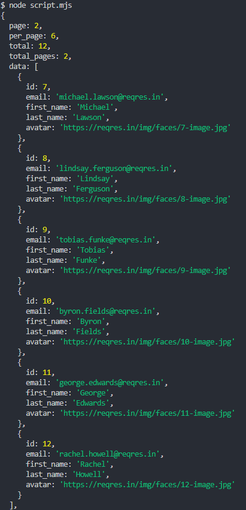

# Fetch Update Data

Projeto que consome a API ReqRes usando Fetch e variáveis de ambiente, também é possível alterar dados/usuários de uma base fictícia para testes.


---
# Instruções:

# 🚀 Como rodar este projeto

Este projeto utiliza **Node.js** e a biblioteca [`node-fetch`](https://www.npmjs.com/package/node-fetch) para realizar requisições HTTP a uma API fake (`reqres.in`).  
O resultado é exibido diretamente no **console/terminal**.

---

## 📌 Pré-requisitos
- [Node.js](https://nodejs.org/) instalado (versão LTS recomendada).
- Git instalado para clonar o repositório.

---

## 📥 Clonar o repositório
```bash
git clone https://github.com/LuSN23/fetch-update-data.git
cd fetch-update-data
```

---

## 📦 Instalar dependências
Se ainda não existir um `package.json`, inicialize:
```bash
npm init -y
```

Depois instale o `node-fetch`:
```bash
npm install node-fetch
```

---

## ▶️ Executar o código
Como o arquivo é **ES Module** (`.mjs`), rode:
```bash
node script.mjs
```

---

## 📊 Resultado esperados:

### Usando GET para recuperar usuários da base (é feito o uso de uma chave gratuita):
Você verá no console a resposta da API, algo como:




### Usando POST para adicionar usuários à base (é necessário uma chave paga):
Você verá no console a resposta da API, algo como:

```json
{
  "id": 7,
  "email": "bob.prescott@reqres.in",
  "first_name": "Robert",
  "last_name": "Prescott",
  "avatar": "https://reqres.in/img/faces/10-image.jpg"
}
```

---

## ⚠️ Observação
Este projeto não possui interface HTML.  
Toda a saída é exibida diretamente no **console** após a execução do script.

---
